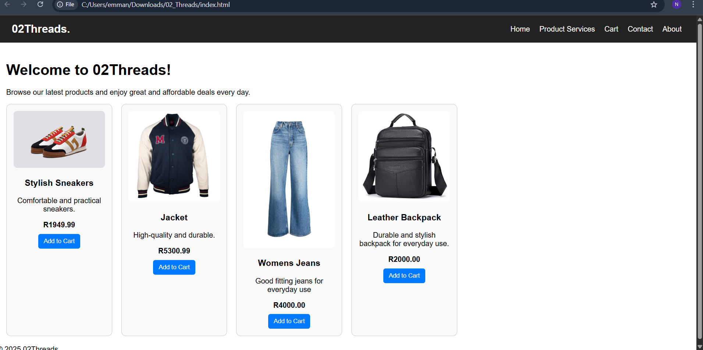

# 1. PROJECT TITLE
O2Threads Website

# 2. Student Information
Student Name: Nyiko
Student  #: ST10472551
Group: 1

# 3. Website goals and objectives
Expand online presence leading to more sales
Increase monthly sales through the website
Build a loyal customer base to ensure consistency in profits
Highlight limited-edition collections to have some sort of exclusivity 
Launch e-commerce website 
Achieve set profit targets for each month

# 4. Key features and functionality
Homepage with featured products
Product services
Cart checkout
About Us 
Contact pages

# 5. Milestones
Week 1: Project Planning and Content Gathering
Week 2: Wireframes and UI Design
Week3: Frontend Development
Week4: Backend Development
Week5: Testing
Week6: Launch website
"# WEDE5020-FPOE-PART-1" 
"# WEDE5020-FPOE-PART-1" 
"# WEDE5020-FPOE-PART-1" 

# 6. Screen Shots

# Changes in Part 3
Added enquiry webpage
Added the enquiry form
Updated the Contact us webpage with the addition on an html form and a location displayed using google maps

Site Map

